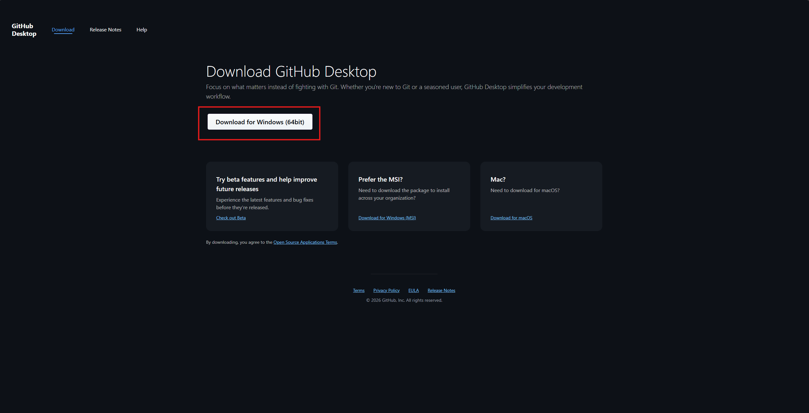

# How to Organize Your Code in Repository

---

## Step 1: Download and login GitHub Desktop

  

---

## Step 3: Clone Your Repository

     
     

---

## Step 4: Organize Your Code

**Fetch** — Check for new changes from the remote repository (GitHub) without modifying your local files:

  

**Pull** — Download changes from the remote repository and merge them into your current branch:

  

Open the repository folder in Explorer:

 

Create a new folder to organize your code:

  

Move your code into the new folder:

     
  

> **Note:** You need a Commit Message to commit files to main, for example: `"update leetcode"`

  

**Push** — Send your local commits to the remote repository (GitHub):

  

Press **F5** to refresh your GitHub page and check your folder:

     
  

---

  <i>Have fun coding!</i>

