# How to Organize Your Code in Repository

A step-by-step guide to managing and organizing your code on GitHub using **GitHub Desktop**.

---

## Table of Contents
- [Step 1: Download and Login to GitHub Desktop](#step-1-download-and-login-to-github-desktop)
- [Step 2: Clone Your Repository](#step-2-clone-your-repository)
- [Step 3: Organize Your Code](#step-3-organize-your-code)
  - [Fetch and Pull](#fetch-and-pull)
  - [Create and Move Files](#create-and-move-files)
  - [Commit and Push](#commit-and-push)
  - [Verify on GitHub](#verify-on-github)

---

## Step 1: Download and Login to GitHub Desktop

Download **GitHub Desktop** from the official website and sign in with your GitHub account.

  

---

## Step 2: Clone Your Repository

Cloning creates a local copy of your remote repository so you can edit files directly on your computer.

**2.1.** In GitHub Desktop, choose **Clone a repository from the Internet**.

  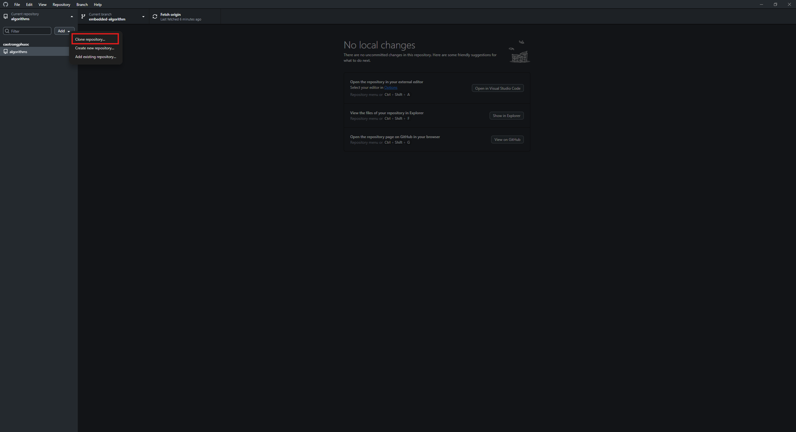

**2.2.** Select the repository you want to clone, choose a local path, then click **Clone**.

  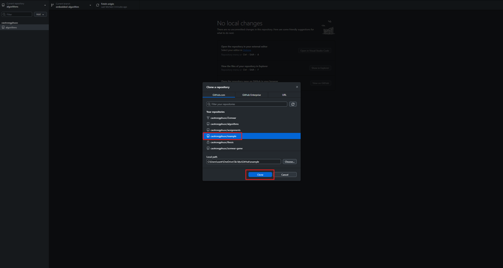

---

## Step 3: Organize Your Code

### Fetch and Pull

**Fetch** — Check for new changes from the remote repository (GitHub) **without** modifying your local files.

  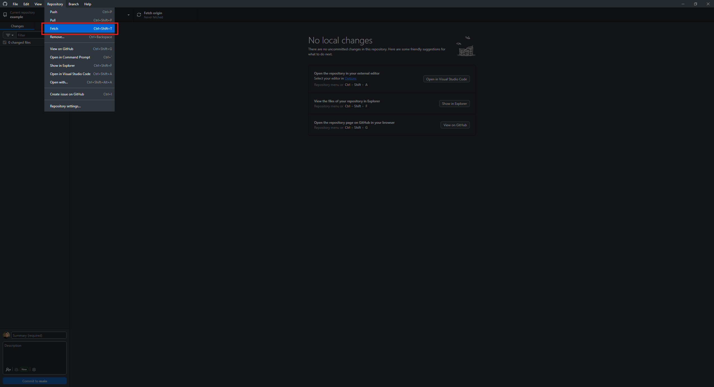

**Pull** — Download the changes from the remote repository and **merge** them into your current branch.

  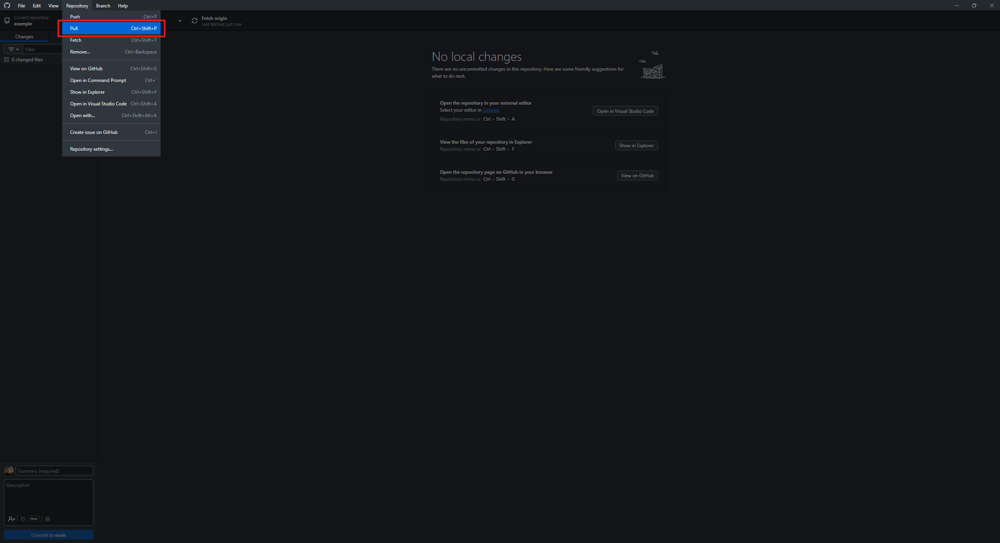

---

### Create and Move Files

**3.1.** Open the repository folder in File Explorer using the **Show in Explorer** option.

  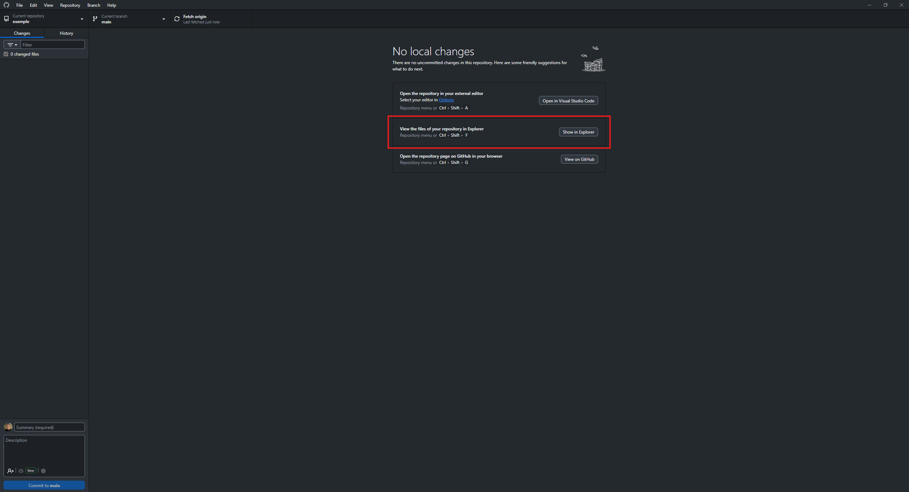

**3.2.** Create a new folder to organize your code by topic or category.

  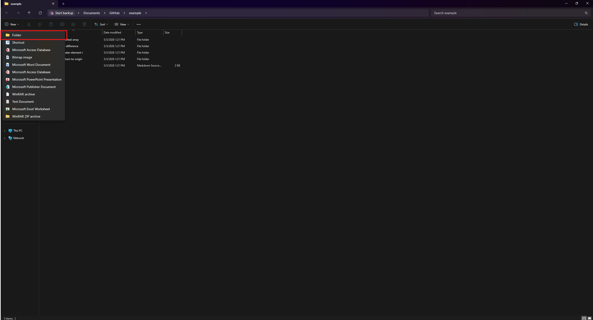

**3.3.** Cut the code files you want to move.

  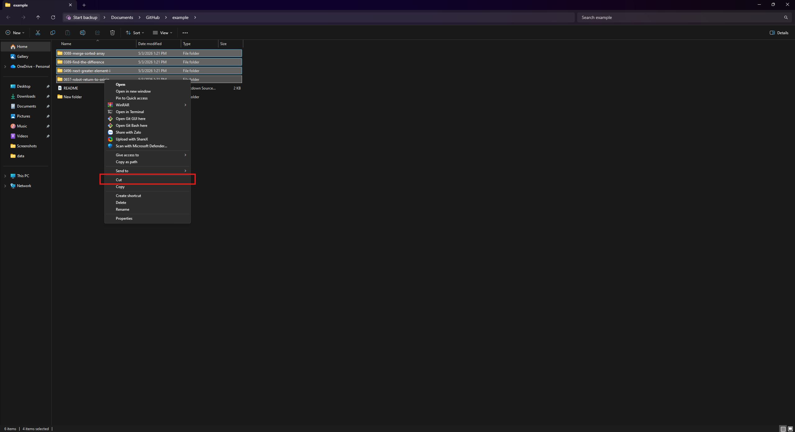

**3.4.** Paste them into the new folder.

  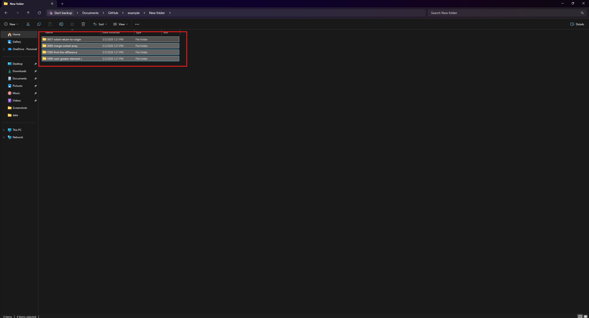

---

### Commit and Push

**3.5.** Back in GitHub Desktop, enter a **Commit Message** describing your changes, then click **Commit to main**.

> **Note:** A commit message is required. For example: `"update leetcode"`.

  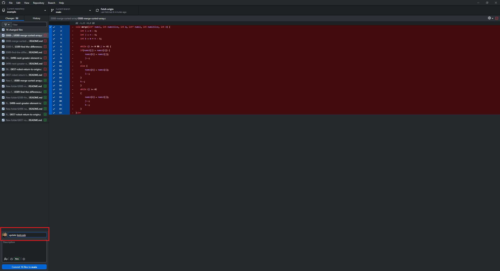

**3.6.** Click **Push origin** to send your local commits to the remote repository on GitHub.

  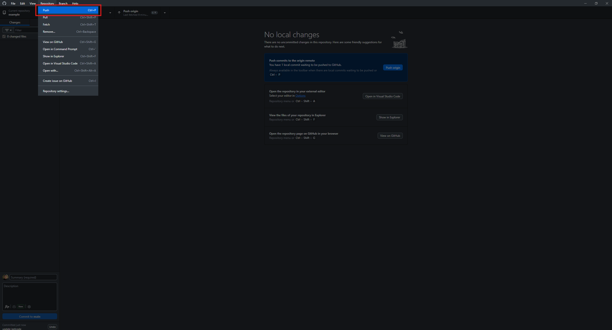

---

### Verify on GitHub

**3.7.** Press **F5** to refresh your GitHub page. The new folder should now appear in your repository.

  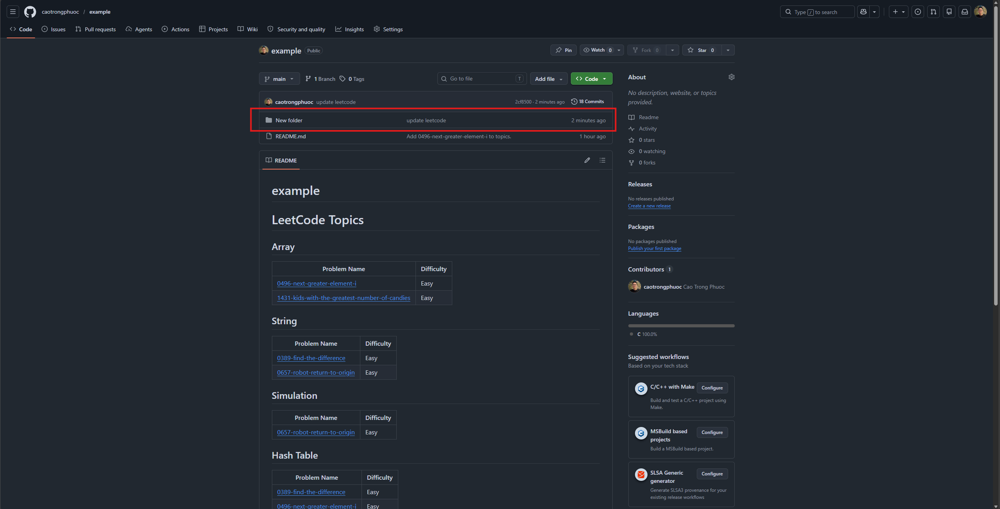

  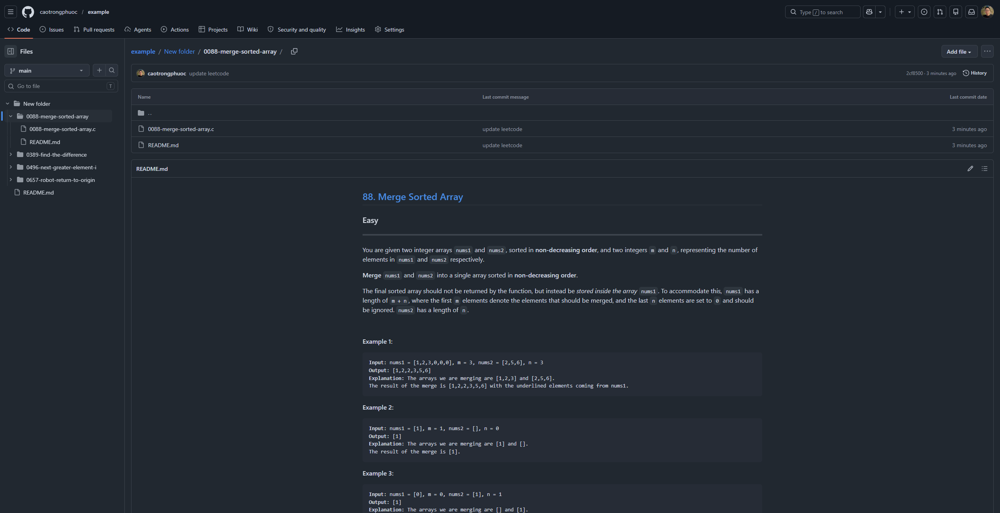

---

  <i>Have fun coding!</i>

