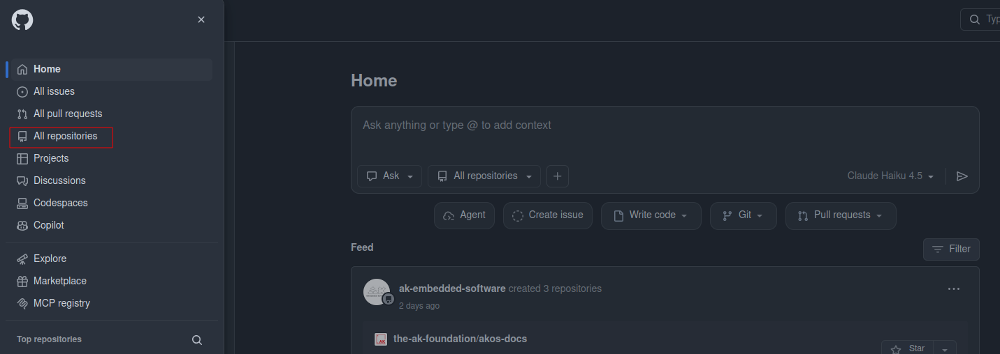
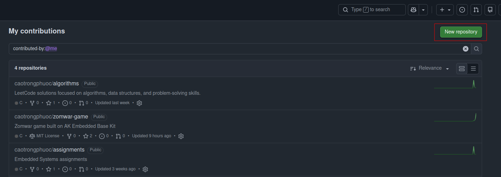
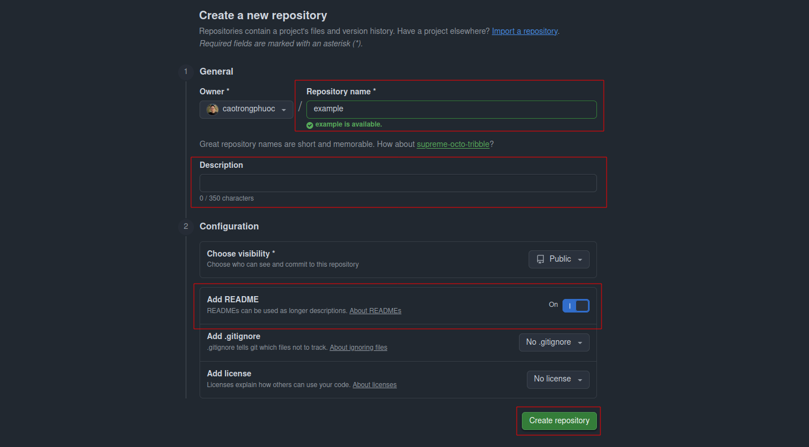
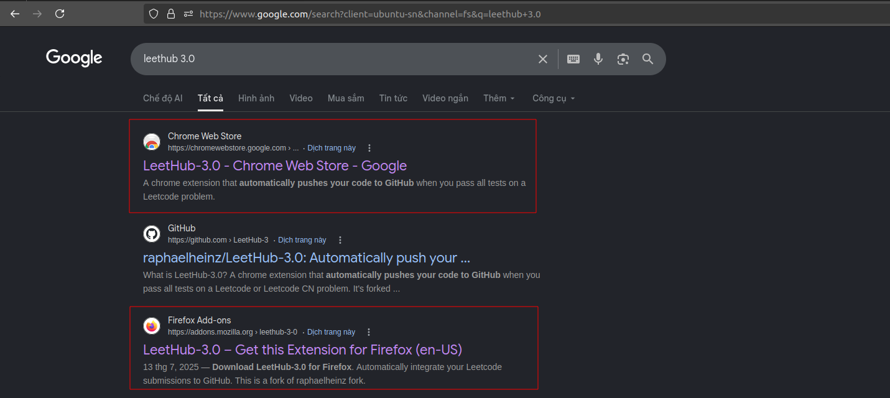
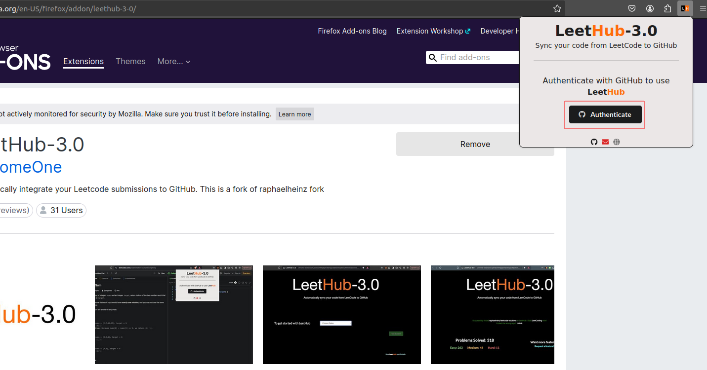
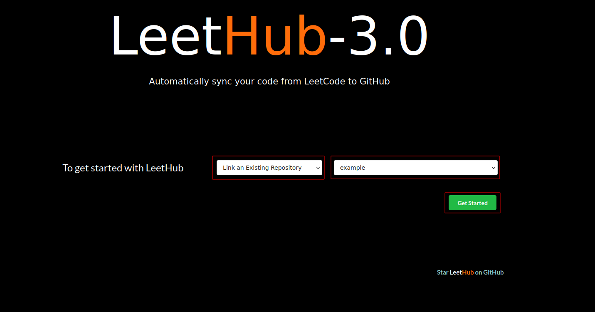
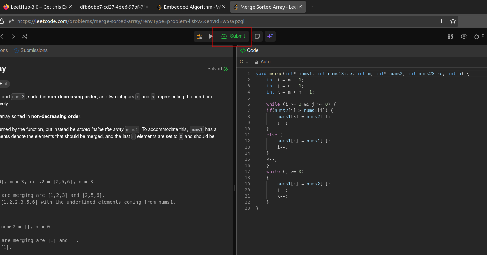
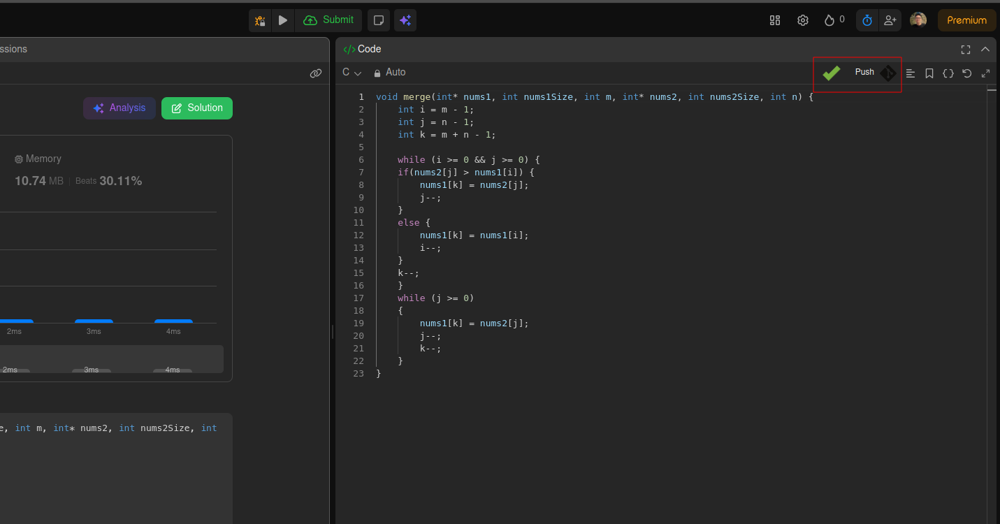
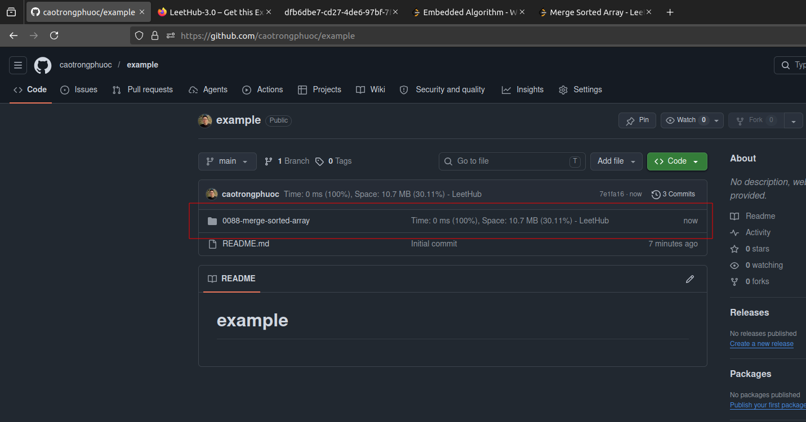
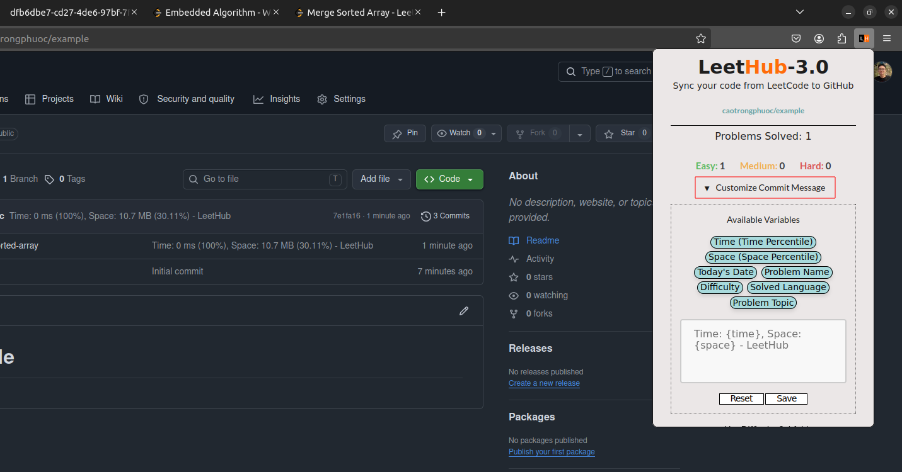

# How to Submit Code from LeetCode to GitHub

A step-by-step guide to automatically push your LeetCode solutions to a GitHub repository using the **LeetHub** extension.

---

## Table of Contents
- [I. Tutorial](#i-tutorial)
  - [Step 1: Create a Repository](#step-1-create-a-repository)
  - [Step 2: Install LeetHub](#step-2-install-leethub)
  - [Step 3: Submit Code from LeetCode](#step-3-submit-code-from-leetcode)
- [II. Warning](#ii-warning)

---

## I. Tutorial

### Step 1: Create a Repository

First, create a new repository on GitHub to store your LeetCode solutions.

**1.1.** Go to your GitHub homepage and locate the repository section.

  

**1.2.** Click **New** to start creating a repository.

  

**1.3.** Fill in the repository name, description, add README, then click **Create repository**.

  

---

### Step 2: Install LeetHub

LeetHub is a browser extension that automatically pushes your accepted LeetCode submissions to GitHub.

**2.1.** Search for **LeetHub** in the Chrome/Edge/FireFox Web Store and add it to your browser.

  

**2.2.** Open the extension and click **Authenticate** to sign in with your GitHub account.

  

**2.3.** Link the extension to the repository you created in Step 1.

  

---

### Step 3: Submit Code from LeetCode

Once LeetHub is set up, every accepted submission can be pushed to GitHub automatically.

**3.1.** Solve a problem on LeetCode and click **Submit**.

  

> **Note:** Wait until the LeetHub icon shows a **green tick** — this confirms your code has been pushed to GitHub successfully.

  

**3.2.** Press **F5** to refresh your GitHub repository page and verify the new commit.

  

#### Customize Your Commit Message

You can edit the default commit message in the LeetHub extension settings to better describe your submissions.

  

---

## II. Warning

> **Important:** Using **Chrome** may fail to upload the `README.md` file (including the problem description) to GitHub.
> **Edge is recommended** for full functionality.

| FireFox | Edge | Chrome |
| :---: | :---: | :---: |
|  |  |  |
| Uploads code **and** README.md | Uploads code **and** README.md | Uploads code **only**, missing README.md |

---
